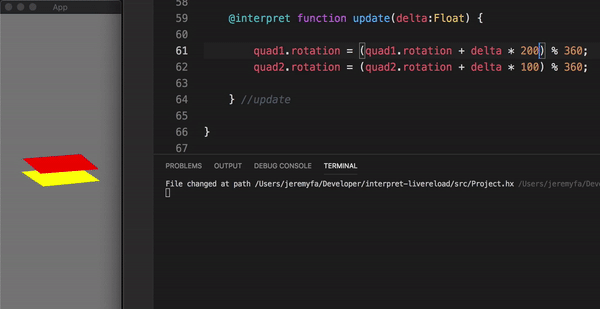

# interpret

Turn haxe classes into scriptable/interpretable/hot-reloadable code using hscript

## Goals

### Execute standard haxe code as script

In contrary of regular hscript, **interpret** takes as input a standard Haxe class. This means you can work on your code with the same IDE, code completino, static analysis tools as you would do for compiled haxe code.

### No need to use haxe compiler to consume scripts

Scripts are loaded as raw text by the app embedding **interpret**, parsed and transformed to hscript on the fly. This means you don't need haxe compiler to load a new script.

As a result, while building a project using haxe compiler can become slower as it gets more and more code in it, updating a script with **interpret** should always be fast, no matter how big is your project, because it doesn't need to build the whole project. It just need to process a single file and execute it, that's it.

### Prefer portability over performance

As **interpret** is built on top of hscript to execute haxe code, it is not expected to be fast, but it is very portable and should work fine with any haxe target.

### Provide live-reload capabilities

It is possible to write haxe classes with live-reloadable methods using **interpret**'s `Interpretable` interface. Simply saving the file will update the code within a second, without restarting the app.

On targets supporting haxe's **sys** API, live reload can work without having to run any custom server. The app itself will just watch for changes on the file system.

It is however possible to provide custom watchers as needed for more complex scenarios. Some ideas: remotely update a mobile app (ios/android) through websockets, embed a code editor in the same app that runs it...

### Try to stay as close as possible to Haxe

While **interpret** cannot reproduce 100% of haxe features as script, it is trying its best to cover most of it. It allows to expose _native_ haxe classes and abstracts (and soon enums) to interpretable code, so that it's possible to call them from script, and write code that works the same way, both as compiled code (with haxe compiler) and interpretable code (with **interpret**).

A typical scenario leveraging this aspect is using **interpret** live-reload while iterating on your app code and testing quickly what it does, then bundling the final binary as compiled, and efficient, haxe code: use scripting in dev, but make no compromise regarding performance in production!

## How to use

### Load an interpretable haxe class

Check out the commented sample code at: [sample/DynamicClassSample.hx](sample/DynamicClassSample.hx)

Run it with: `haxe sample-dynclass.hxml`

### Create class live-reloadable methods

Check out the commented sample code at: [sample/LiveReloadSample.hx](sample/LiveReloadSample.hx)

Run it with: `haxe sample-livereload.hxml`

## What works?

To see what haxe features are supported, you can take a look at the haxe files in [test script directory](/test/script/), which are all tested and compatible with **interpret**.

**interpret** is still at an early stage of development and can be improved a lot. New features, like handling of enums and pattern matching, will be added in the future.

## Roadmap

**interpret** will be improved to become more and more complete, here are the things that will probably be worked on next:

- [ ] Expose enums to interpreted code
- [ ] Handle switches with pattern matching
- [ ] Handle arrow functions
- [ ] Handle abstract operators?
- [ ] Hunt and fix any edge case?
